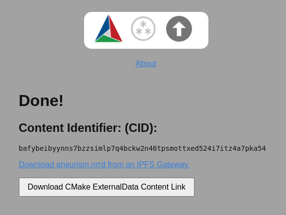

# cmake-w3-externaldata-upload

[](https://content-link-upload.netlify.app)

[CMake Web3 ExternalData Upload UI](https://content-link-upload.netlify.app)

Based on [the Storacha client](https://docs.storacha.network/js-client/) and [w3ui](https://github.com/storacha/w3ui).

## About

Since every local [Git](https://git-scm.com/) repository contains a copy
of the entire project history, it is important to avoid adding large
binary files directly to the repository. Large binary files added and
removed throughout a project\'s history will cause the repository to
become bloated, take up too much disk space, require excessive time and
bandwidth to download, etc.

A [solution to this
problem](https://blog.kitware.com/cmake-externaldata-using-large-files-with-distributed-version-control/)
which has been adopted by this project, is to store binary files such as
images in a separate location outside the Git repository. Then, download
the files at build time with [CMake](https://cmake.org/).

A \"content link\" file contains an identifying [Content Identifier
(CID)](https://proto.school/anatomy-of-a-cid). The content link is
stored in the [Git](https://git-scm.com/) repository at the path where
the file would exist, but with a \".cid\" extension appended to the file
name. CMake will find these content link files at *build* time, download
them from a list of HTTP server resources, and create symlinks or copies of
the original files at the corresponding location in the *build tree*.

The [Content Identifier (CID)](https://proto.school/anatomy-of-a-cid) is
self-describing hash following the [multiformats
](https://multiformats.io/) standard created by the Interplanetary
Filesystem ([IPFS](https://ipfs.io/)) community. A file with a CID for
its filename is content verifable. Locating files according to their CID
makes content-addressed, as opposed to location-addressed, data exchange
possible. This practice is the foundation of the decentralized web, also
known as the dWeb or Web3. By adopting Web3, we gain:

-   Permissionless data uploads
-   Robust, redundant storage
-   Local and peer-to-peer storage
-   Scalability
-   Sustainability

Contributors upload their data through an easy-to-use,
permissionless, free service, [storacha.network](https://storacha.network/).

Data used in the Git repository is periodically tracked in a
dedicated [Datalad
repository](https://datalad.org)
and stored across redundant locations so it can be retrieved from any of
the following:

-   Local [IPFS](https://ipfs.io/) nodes
-   Peer [IPFS](https://ipfs.io/) nodes
-   [storacha.network](https://storacha.network/)
-   [pinata.cloud](https://pinata.cloud)

*Note: This currently requires an extended version of the ExternalData.cmake module developed in the [CMakeIPFSExternalData repository](https://github.com/InsightSoftwareConsortium/CMakeIPFSExternalData). This has not been integrated into upstream CMake due to the availability of C++ CID verification code to complete the feature set in a
portable way.* 

## Architecture

The application consists of two parts:

1. **Frontend** (Vite SPA) - Static site that handles file uploads directly from the browser to Storacha using `@storacha/client`. Deployed to Netlify (or any static host).

2. **Backend** ([Cloudflare Worker](https://developers.cloudflare.com/workers/)) - Handles authentication (GitHub OAuth), upload authorization (UCAN delegation), quota/blacklist enforcement (D1 database), and email notifications (MailJet). Located in the `worker/` directory.

**Upload flow:**
1. User signs in via GitHub OAuth (handled by the Worker)
2. User selects a file in the browser
3. Browser requests a UCAN delegation from the Worker (which checks quota/blacklist)
4. Browser uploads the file directly to Storacha (file bytes never touch the Worker)
5. Browser reports the completed upload to the Worker (which logs it and sends a notification email)

## Development

### Clone, install dependencies:

```sh
git clone https://github.com/InsightSoftwareConsortium/cmake-w3-externaldata-upload
cd cmake-w3-externaldata-upload
```

Install [pixi](https://pixi.sh/) if not already installed:

```sh
curl -fsSL https://pixi.sh/install.sh | sh
```

### Configure secrets

The Cloudflare Worker requires several secrets. For local development, create a `worker/.dev.vars` file:

```
GITHUB_CLIENT_ID=your_github_oauth_app_client_id
GITHUB_CLIENT_SECRET=your_github_oauth_app_client_secret
SESSION_SECRET=a_random_secret_string_for_signing_cookies
STORACHA_KEY=your_storacha_agent_key
STORACHA_PROOF=your_storacha_delegation_proof_base64
MJ_APIKEY_PUBLIC=your_mailjet_public_key
MJ_APIKEY_PRIVATE=your_mailjet_private_key
SENDER_EMAIL=sender@example.com
RECIPIENT_EMAIL=recipient@example.com
FRONTEND_URL=http://localhost:5173
```

#### GitHub OAuth App

Create a [GitHub OAuth App](https://github.com/settings/developers):
- **Homepage URL:** `http://localhost:5173` (dev) or your production URL
- **Authorization callback URL:** `http://localhost:8787/auth/callback` (dev) or `https://your-worker.workers.dev/auth/callback` (production)

Store the Client ID and Client Secret as `GITHUB_CLIENT_ID` and `GITHUB_CLIENT_SECRET`.

#### Storacha

Generate upload credentials using the [Storacha CLI](https://docs.storacha.network/how-to/upload/#bring-your-own-delegations):

```sh
npm install -g @storacha/cli
storacha login <your-email>
storacha space use <space-did>

# Generate agent key -- store the key (starting "Mg...") as STORACHA_KEY
storacha key create --json

# Create delegation -- store the base64 output as STORACHA_PROOF
storacha delegation create <did_from_above> \
  --can space/blob/add \
  --can space/index/add \
  --can filecoin/offer \
  --can upload/add \
  --base64
```

#### MailJet

For monitor emails, set the [MailJet](https://mailjet.com) keys `MJ_APIKEY_PUBLIC`, `MJ_APIKEY_PRIVATE`. Also `SENDER_EMAIL` and `RECIPIENT_EMAIL`. Note that DNS records should be set for the sender and the sender configured in MailJet.

### Initialize the local database

```sh
pixi run worker-db-init
```

### Run the dev server

```sh
pixi run dev
```

This starts the Cloudflare Worker (via `wrangler dev` on port 8787) and the Vite frontend dev server (on port 5173) concurrently. The Vite dev server proxies `/auth/*` and `/api/*` requests to the Worker.

Visit [http://localhost:5173](http://localhost:5173) to view the application.

### Production deployment

#### Deploy the Worker

Set secrets on the deployed Worker:

```sh
cd worker
wrangler secret put GITHUB_CLIENT_ID
wrangler secret put GITHUB_CLIENT_SECRET
wrangler secret put SESSION_SECRET
wrangler secret put STORACHA_KEY
wrangler secret put STORACHA_PROOF
wrangler secret put MJ_APIKEY_PUBLIC
wrangler secret put MJ_APIKEY_PRIVATE
wrangler secret put SENDER_EMAIL
wrangler secret put RECIPIENT_EMAIL
wrangler secret put FRONTEND_URL
```

Create and initialize the D1 database:

```sh
wrangler d1 create cmake-w3-externaldata-upload
# Update the database_id in worker/wrangler.toml with the returned ID
pixi run worker-db-init-remote
```

Deploy:

```sh
pixi run worker-deploy
```

#### Deploy the frontend

The frontend is built via `pnpm run build` and deployed to Netlify (or any static host). Set the `VITE_API_URL` environment variable to point to your deployed Worker URL if it differs from the frontend origin.

The content-link-upload.itk.org is served on
https://content-link-upload.netlify.app and built via `pnpm run build`.
